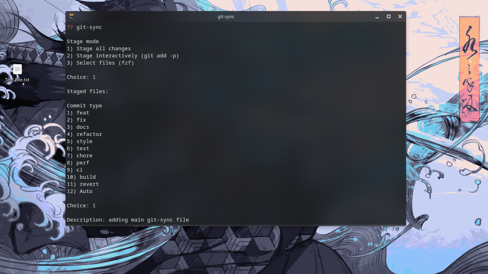

# dev-tools

tools that i use a lot think worth to share with you

# git sync

it automates the process of writing commits very usefull
---

to use you need add it to your local bin folder and give permition

```bash
.local/bin/git-sync

chmod +x ~/.local/bin/git-sync
```

after that you call git-sync in the terminal



---
